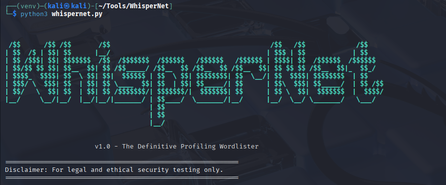

# WhisperNet - The Definitive Profiling Wordlister
<pre>
 __      __.__    .__                             _______          __   
/  \    /  \  |__ |__| ____________   ___________ \      \   _____/  |_ 
\   \/\/   /  |  \|  |/  ___/\____ \_/ __ \_  __ \/   |   \_/ __ \   __\
 \        /|   Y  \  |\___ \ |  |_> >  ___/|  | \/    |    \  ___/|  |  
  \__/\  / |___|  /__/____  >|   __/ \___  >__|  \____|__  /\___  >__|  
       \/       \/        \/ |__|        \/              \/     \/      
</pre>



WhisperNet is a Python-based profiling wordlist generator designed for security professionals and ethical hackers. It creates highly targeted, customized password lists based on personal information, dramatically increasing the efficiency of password cracking attempts during authorized penetration tests.

Instead of relying on generic wordlists, WhisperNet builds its list from details about the target, their family, interests, and important dates, applying common password creation patterns and mutations.

---

## Table of Contents

- [Key Features](#key-features)
- [Disclaimer](#disclaimer)
- [Getting Started](#getting-started)
  - [Installation](#installation)
  - [Configuration](#configuration)
- [Usage](#usage)
- [Sample Output](#sample-output)
- [Contribution](#Contribution)
- [License](#license)

---
## Key Features

*   **Interactive Profiling:** An easy-to-use, guided command-line interface to gather detailed information about the target, including family members, partners, children, and more [1].
*   **Multi-Faceted Data Parsing:** Extracts potential keywords from names, nicknames, dates of birth, emails, phone numbers, and even vehicle plates [1].
*   **Advanced Mutations:** Applies a variety of mutations to the base keywords, including:
    *   **Case Mutations** (e.g., `word` -> `Word`) [1].
    *   **Leetspeak** (e.g., `password` -> `p@$$w0rd`) based on a configurable map [2].
    *   **Affixing:** Adds common prefixes and suffixes (e.g., `word` -> `word!`, `@word`) [1].
*   **Custom Pattern Generation:** Creates passwords based on common real-world patterns like `Name@Birthdate` or `NicknameLove` [1].
*   **Dynamic Year Generation:** Automatically includes the current, previous, and next years in the number list to account for recently changed passwords [1].
*   **Highly Configurable:** A simple `config.cfg` file allows you to control every aspect of the generation engine—from enabling/disabling features to defining the characters used in mutations [2].
*   **Intelligent Filtering:** Includes an email domain blacklist to prevent common, low-value words like 'gmail' or 'com' from cluttering the wordlist [2].
*   **Length Filtering:** Allows you to filter the final wordlist to a specific password length [1].


---

## Disclaimer

> **This tool is intended for legal and ethical security testing purposes only.** The user is responsible for their actions and must have explicit, written permission from the target organization before using this tool. The creator is not responsible for any misuse or damage caused by this program.

---

## Getting Started

Follow these instructions to get a local copy up and running.

### Prerequisites

*   Python 3.x
*   pip
*   colorama, tqdm (covered in requirements.txt)

### Installation

#### 1. Clone the repository:
```bash
git clone https://github.com/AyushParkara/WhisperNet.git
````

#### 2. Navigate to the project directory:

```bash
cd WhisperNet
```

#### 3. Install dependencies:

```bash
pip install -r requirements.txt
```

> ✅ Python 3.7+ is recommended.

---

### Configuration

WhisperNet's behavior is controlled by the `config.cfg` file [2]. This file must be in the same directory as `whispernet.py`.

*   **`[BEHAVIOR]`**: Master switches to enable or disable core features like leetspeak, case mutations, word combinations, and affixing.
*   **`[AFFIXES]`**: Define the default `prefixes` and `suffixes` used in mutations. You can also add a static list of `extra_years`.
*   **`[EMAIL_FILTER]`**: A comma-separated list of email domain parts to ignore during parsing. This keeps your wordlist clean from noise like 'gmail', 'com', 'hotmail', etc. [2].
*   **`[LEETSPEAK]`**: The character substitution map for leetspeak mutations. You can add or change any substitution here (e.g., `a = @,4`) [2].
*   **`[SPECIAL_CHARS]`**: A comprehensive list of special characters used when you opt-in to the "ALL special characters" mode during generation [2].

> A sample configuration file is provided as `config.cfg.example`. Copy and customize it:

```bash
cp config.cfg.example config.cfg
```

---

## Usage

Start the tool:

```bash
python whispernet.py
```

You’ll be guided through an interactive series of prompts to:

1.  **Enter Target Details:** Provide the name, surname (optional), nickname (optional), and date of birth (YYYY-MM-DD) for the primary target [1].
2.  **Enter Family Details:** The script will ask if you want to add details for the target's father, mother, partner, and children. This adds valuable keywords and dates [1].
3.  **Enter Identifiers & Keywords:** You will be prompted to add email addresses, phone numbers, vehicle plates, and other important keywords like company name, city, street name, and custom words (e.g., pets, hobbies) [1].
4.  **Select Generation Mode:** You can choose to add specific, common patterns (like `name@bday`) to the wordlist first [1].
5.  **Choose Generation Options:** Configure the "Full Mutation Engine" for this specific run. You can opt to use all special characters for affixes, generate blank space passwords, and filter the final list by a desired length [1].
6.  **Provide Output Filename:** Enter a name for your final wordlist file (e.g., `wordlist.txt`).
### Output

After completion, you’ll be prompted to name your wordlist file. The final list is saved in `.txt` format with thousands of intelligently crafted combinations.

---

## Sample Output

```
john1995
@john
john@0314
mama1990
dad2023
smithjohn
babyjohn!
```

> Want more patterns? WhisperNet supports combining inputs with special characters, number substitutions, and much more.

---

## Contribution

Have an idea to improve WhisperNet? Contribute by submitting a Pull Request:

1. Fork the repository
    
2. Create a feature branch:
    
    ```bash
    git checkout -b feature/YourFeatureName
    ```
    
3. Commit your changes:
    
    ```bash
    git commit -m "Add YourFeatureName"
    ```
    
4. Push to your branch:
    
    ```bash
    git push origin feature/YourFeatureName
    ```
    
5. Open a Pull Request on GitHub
    

---
> 💡 Got suggestions or feature ideas? Open an issue or submit a PR — your enhancements are always appreciated!

## License

This project is licensed under the [GNU License](LICENSE).

---

> Inspired by real-world red team engagements and a love for intelligent automation in offensive tooling.
